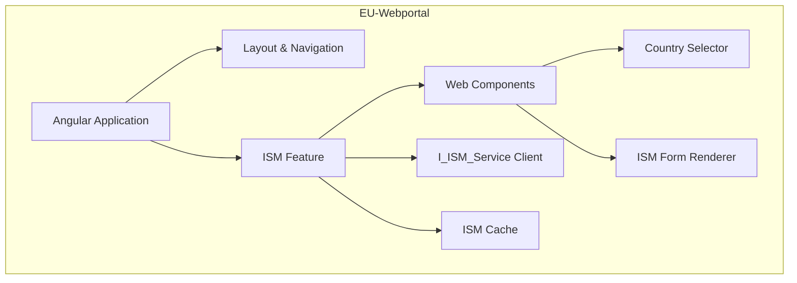

# C4 Container Diagram Webapp

## Diagramm 2: Komponentenansicht WebApp

```mermaid
graph TB

    subgraph EUWP["EU-Webportal"]
        Angular["Angular Application"]

        Layout["Layout & Navigation"]

        ISM["ISM Feature"]

        Components["Web Components"]

        CountrySelector["Country Selector"]        
        FormRenderer["ISM Form Renderer"]

        ISMClient["I_ISM_Service Client"]
        
        ISMCache["ISM Cache"]
    end


    Angular --> Layout
    Angular --> ISM

    ISM --> Components
    ISM --> ISMClient
    ISM --> ISMCache
    
    Components --> CountrySelector
    Components --> FormRenderer

```